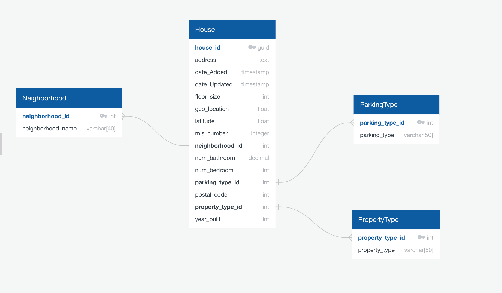

# Analyzing_Property_Home_Value
<<<<<<< HEAD
Analyzing property values in Austin, Texas

**RUBRIC SUBMISSION #3

# Austin HOUSING
**RUBRIC SUMBISSION #1**

## **PRESENTATION**
- *SELECTED TOPIC*
- *REASON FOR SELECTED TOPIC*
- *DESCRIPTION OF THE SOURCE DATA*
- *QUESTIONS WE HOPE TO ANSWER WITH THE DATA*
[^]: Note: the content does not yet need to be in the form of a presentation; text in the README.md works as well.
=======
Analyzing property values

Housing has a variety of housing options, single family, multi-family, townhouses, etc.  We will analyze the trends in housing types and prices amongst the dataset.  We are interested in this area due to the large volume of home sales in recent years. We found the effect of this increase on home prices and types to be an area for further study.

We will utilize information derived from from Datafiniti and Kaggle.com, and utilize their information via csv or API.  The information provided shows housing prices, types and zip code  This contains beginning and end dates of the sample, as well as, county location and home type. Datafiniti provides an API that we can use to call specifically what we need to help perform our research.  After which, we can join the two datasets to create a more robust set of data to analyze.
>>>>>>> de10dae1e5500d6f194ba293c65645ba61ca3fba

By conducting this data analysis, we should be able to determine: the most common factors in a home price with the given dataset.

<<<<<<< HEAD
We will utilize information derived from from Redfin and Zillow, well known real estate websites, and utilize their information via csv or API.  The infomration provided shows housing prices, types and county.  Redfin provides a csv file for all counties within the continental United States.  This contains beginning and end dates of the sample, as well as, county location and home type.

Zillow provides an API that we can use to call specifically what we need to help perform our research.  After which, we can join the two datasets to create a more robust set of data to analyze.
=======
Our communication, based on the work/life balance of our team members, will primarily be carried out by group chat in Slack.  Within Slack, we will highlight tasks and each member will be assigned to complete.  Our motto "no person is an island" is to ensure we don't intend anyone to complete the assigned task when help is needed.  We will utilize a due date for all project items and support one another.
>>>>>>> de10dae1e5500d6f194ba293c65645ba61ca3fba

Given the dataset and known questions, we will be utilizing a supervised learning where our model will analyze the data and attempt to learn patterns.  From there, we can improve our predictions.  

The dataset from kaggle.com was in csv form and 15,171 rows and 47 columns.  The first item was to locate the price, in this case, the column was titled latest price, and we changed the name to price for simplicity. 

We looked at the sale data by year to understand the periods we were looking at; 2018, 2019, 2020, 2021.  From there found the min and max of the dataset to help perfrom an average increase in values by home type.

Since we were primarily looking at Single family type house, we removed multiple occupancy, vacant land, apartments, mobile and other from the dataset and focused on Singly, Condo and Townhomes.  

We also wanted to eliminate multiple listings for a specific property as the dataset was only 4 years, so we eliminated any duplicate listings by latitude and longitude.

Plotting a scatterplot with seaborn on price by long and lat, visually noticed outliers around the 30.5 lat and eliminated anything below that heading.

Using a histograms, multitple times during the refinement and cleanup process, added a visual element to help eliminate single items or columns from the dataset or improve them when needed.  In addition to visually eliminating or highlighting data with histograms, the next step was to use IQR to help eliminate outliersz outside the lower and upper range of calculated quadrants.

Anecdotal evidence suggests zip codes to be a major factor in home prices.  This lead us to perform a ranking by zip code on median price to create a dataframe for further study.  We utilized several scatterplots on several ranking categories to see any outliers.  Again, using the histogram, we were able to note several zip codes with incomplete or insufficient data and removed them from the dataframe.

Checking our distribution utilizing a histogram and probability plot and saw our sales price histogram was positively skewed with a high peak.  And our probability plot was skewed right with heavy tails.  To help normalize this information, we used a log transformation with can help with skewed data, and after running it, we were able to normalize the distribution and decided to use the log transformation infomration in our dataset.  We ran a correlation heat map and picked the  top items; zipcode; avgSchoolRatin; livingAreaSqFt; numOfBathrooms; for our model.

We decided to use XGBoost or optimized distributed gradient boostingfor our machine learning.  A one hot encoding is a representation of categorical variables as binary vectors. This first requires that the categorical values be mapped to integer values. Then, each integer value is represented as a binary vector that is all zero values except the index of the integer, which is marked with a 1. A target encoding is any kind of encoding that replaces a feature's categories with some number derived from the target.

With this model, we achieved an R squared of 71.32% and a MAE of 82k.  We'd like to see the R2 to be closer to 75% and the MAE(mean absolute value).  We were unable to get those results with several attempts and tries.  Most of the attempts resulted in a lower R squared than the 71.32%

The model can explain 72% of the price variance with features, however, it is far from accurate.  This is demonstrated in the real world, when Zillow, a company known for its real estate infomration, embarked on a business to buy, rent and flip houses, and failed miserably after serveral months and stopped that business segment.

<<<<<<< HEAD
Given the dataset and known questions, we will be utilizing a supervised learning where our model will analyze the data and attempt to learn patterns.  From there, we can improve our predictions.  

The dataset from kaggle.com was in csv form and 15,171 rows and 47 columns.  The first item was to locate the price, in this case, the column was titled latest price, and we changed the name to price for simplicity. 

We looked at the sale data by year to understand the periods we were looking at; 2018, 2019, 2020, 2021.  From there found the min and max of the dataset to help perfrom an average increase in values by home type.

Since we were primarily looking at Single family type house, we removed multiple occupancy, vacant land, apartments, mobile and other from the dataset and focused on Singly, Condo and Townhomes.  

We also wanted to eliminate multiple listings for a specific property as the dataset was only 4 years, so we eliminated any duplicate listings by latitude and longitude.

Plotting a scatterplot with seaborn on price by long and lat, visually noticed outliers around the 30.5 lat and eliminated anything below that heading.

Using a histograms, multitple times during the refinement and cleanup process, added a visual element to help eliminate single items or columns from the dataset or improve them when needed.  In addition to visually eliminating or highlighting data with histograms, the next step was to use IQR to help eliminate outliersz outside the lower and upper range of calculated quadrants.

Anecdotal evidence suggests zip codes to be a major factor in home prices.  This lead us to perform a ranking by zip code on median price to create a dataframe for further study.  We utilized several scatterplots on several ranking categories to see any outliers.  Again, using the histogram, we were able to note several zip codes with incomplete or insufficient data and removed them from the dataframe.

Checking our distribution utilizing a histogram and probability plot and saw our sales price histogram was positively skewed with a high peak.  And our probability plot was skewed right with heavy tails.  To help normalize this information, we used a log transformation with can help with skewed data, and after running it, we were able to normalize the distribution and decided to use the log transformation infomration in our dataset.  We ran a correlation heat map and picked the  top items; zipcode; avgSchoolRatin; livingAreaSqFt; numOfBathrooms; for our model.

We decided to use XGBoost or optimized distributed gradient boostingfor our machine learning.  A one hot encoding is a representation of categorical variables as binary vectors. This first requires that the categorical values be mapped to integer values. Then, each integer value is represented as a binary vector that is all zero values except the index of the integer, which is marked with a 1. A target encoding is any kind of encoding that replaces a feature's categories with some number derived from the target.

With this model, we achieved an R squared of 71.32% and a MAE of 82k.  We'd like to see the R2 to be closer to 75% and the MAE(mean absolute value).  We were unable to get those results with several attempts and tries.  Most of the attempts resulted in a lower R squared than the 71.32%

The model can explain 72% of the price variance with features, however, it is far from accurate.  This is demonstrated in the real world, when Zillow, a company known for its real estate infomration, embarked on a business to buy, rent and flip houses, and failed miserably after serveral months and stopped that business segment.
=======
>>>>>>> de10dae1e5500d6f194ba293c65645ba61ca3fba

## **DASHBOARD**
[Tableau Dashboard](https://public.tableau.com/app/profile/zachary.allgood/viz/AnalyzingPropertyValuesinTennessee/Story1?publish=yes)

## **DATABASE**
- Datafiniti has provided us more data fields to work with ML. Based on the new additional data, primary and foreign keys are identified to set the relationships among tables.
https://app.quickdatabasediagrams.com/#/d/16VZbE
Team is looking into additional data sources and expand on analysis further in the next segment.

